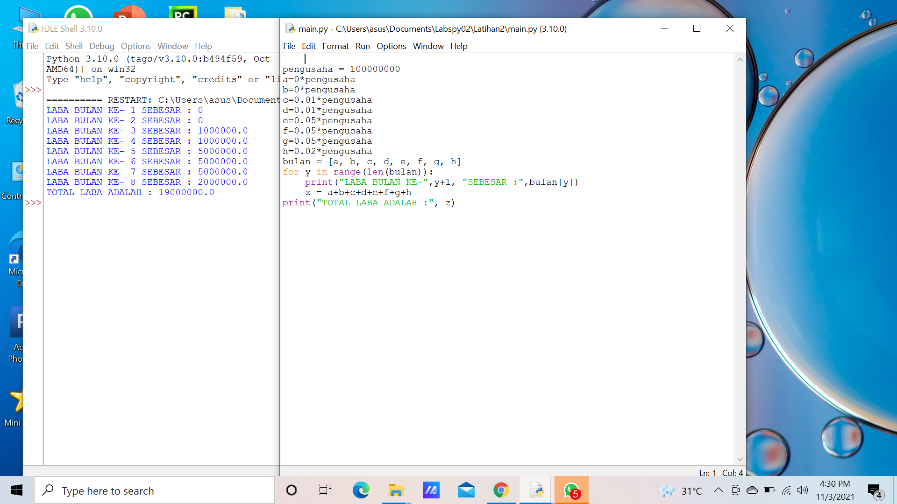

# labpy03

- Latihan 1

1. Gunakan from random import random terlebih dahulu
2. Buat variabel n (bilangan acak yang kurang dari 0.5) yang dapat diinputkan user
3. while n==n:
        break
4. Buat variabel bilangan random dengan nilai yang kurang dari 0.5
5. Cetak bilangan random

 Hasil Input dan Outputnya 
     

 - Latihan 2

1. Buat variabel bil1,bil2, dan bil3.
2. Sertakan input untuk memasukkan bilangan oleh si user
3. Terbesar = bil1 if bil2 > terbesar terbesar = bil2 if bil3 > terbesar terbesar = bil3
4. Cetak bilangan terbesar

Hasil Input dan Outputnya 

- Program 1

1. Buat variabel dengan nilai 100000000
2. Buat variabel bulan dengan list [a,b,c,d,e,f,g,h]
3. Masukkan nilai sebagai berikut:
    bulan ke-1: tidak ada laba
    bulan ke-2: tidak ada laba
    bulan ke-3: 1%
    bulan ke-4: 1%
    bulan ke-5: 5%
    bulan ke-6: 5%
    bulan ke-7: 5%
    bulan ke-8: 2%
4. Loop for y in range(len(bulan))
5. Cetak laba per bulan 
6. Cetak total laba

Hasil Input dan Outputnya

     